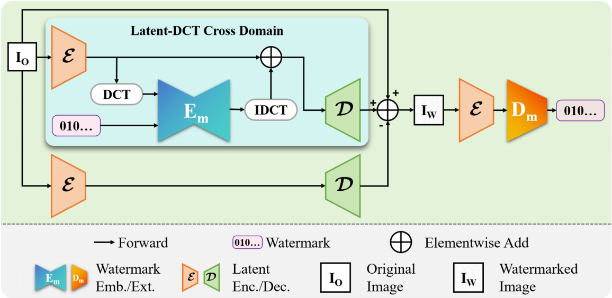
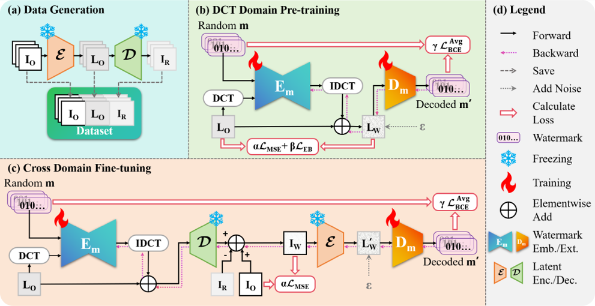
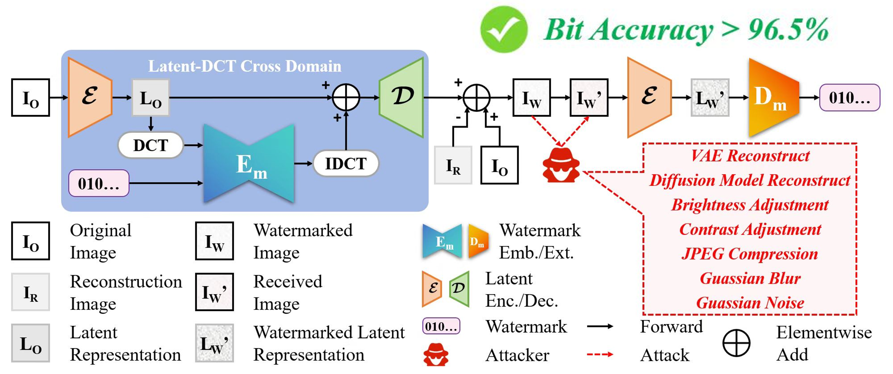

# Robust Latent-DCT Domain Image Watermarking

[](https://python.org)
[](https://pytorch.org)
[](LICENSE)

[English](README_en.md) | [中文](README.md)

This repository is the official implementation of our paper, **proposing a robust image watermarking method in the VAE latent space using frequency domain embedding**. Related code will be uploaded later.

## 📋 Table of Contents
<table>
<tr>
<td>

- [Overview](#overview)  
- [Features](#features)  
- [Environment Setup](#environment-setup)  
- [Usage](#usage)  
- [Project Structure](#project-structure)  

</td>
<td>

- [Performance Evaluation](#performance-evaluation)  
- [Acknowledgments](#acknowledgments)  
- [License](#license)  
- [Contact](#contact)  
<!-- - [Citation](#citation) -->

</td>
</tr>
</table>

## 🔍 Overview



We propose a frequency domain watermarking framework that operates in the latent space of Variational Autoencoders (VAE). Our method achieves superior robustness against various attacks while maintaining high visual quality through a two-stage training process.

## ✨ Features

- 🎯 **High Robustness**: Resistant to attacks including JPEG compression, noise, blur, and diffusion-based attacks
- 🚀 **Efficient Processing**: Fast embedding and extraction using pre-trained VAE latents and DCT transforms
- 🔑 **Flexible Keys**: Supports three key generation modes (random, fixed, specified)
- 📊 **Comprehensive Metrics**: PSNR, SSIM, LPIPS for quality assessment
- 🛡️ **Attack Simulation**: Built-in example attack code for robustness evaluation
- 📈 **Threshold Calculation**: Automatic threshold computation for watermark detection

## 🛠️ Environment Setup

### Prerequisites
- Python 3.8+
- PyTorch 2.4+
- CUDA-compatible GPU (recommended)

### Setup Environment
```bash
git clone https://github.com/lin-zk/HiRaLD
cd HiRaLD
conda create --name envPy38_HiRaLD python=3.8
conda activate envPy38_HiRaLD
pip install -r requirements.txt
```

## 🚀 Usage



### Pre-trained Model Weights
We will release our trained model weights later, including multiple versions trained on DiffusionDB and ImageNet datasets. Alternatively, you can also train them yourself by following steps 1, 2, and 3 below.

### 1. Dataset Pre-processing
You can choose your own dataset and pass it via the dataset_dir parameter. The dataset should consist of ```train```, ```val```, and ```test``` subfolders.
```bash
python DatasetMaker.py \
    --dataset_dir /path/to/your/dataset \
    --save_dir /path/to/preprocessed/dataset
```

### 2. Stage 1 Training (Joint Training of the Watermark Embedder and Extractor)
```bash
python TrainStage1.py \
    --data_dir /path/to/preprocessed/dataset \
    --output_dir /path/to/your/experiment/folder
```
Results are saved in save_dir/Stage1, supports TensorBoard for real-time training monitoring.

### 3. Stage 2 Training (Cross Domain Fine-tuning)
```bash
python TrainStage2.py \
    --data_dir /path/to/preprocessed/dataset \
    --output_dir /path/to/your/experiment/folder \
    --checkpoint_dir path/to/last/saved/model/folder/from/stage1 (files in Stage1/experiment_time/checkpoints)
```
Results are saved in save_dir/Stage2, supports TensorBoard for real-time training monitoring.

### 4. Embed Watermarks
```bash
python Embed.py \
    --data_dir /path/to/images/to/watermark \
    --output_dir /path/to/save/watermarked/images \
    --checkpoint_dir path/to/best/saved/model/folder/from/stage2 (files in Stage2/experiment_time/checkpoints) \
    --fingerprint_type the/watermark/mode/you/need (random, fix, certain) \
    <--fingerprint_content if you chose "certain", then you need to provide the watermark content, write it in hexadecimal in a txt file and pass its path here, or directly pass the hexadecimal string here>
```
Results are saved in output_dir, watermarked image filenames are "original_image_name_hex_watermark_string.png", additionally outputs embedding_metrics.txt for recording embedding quality (PSNR, SSIM, LPIPS)

### 5. Extract Watermarks
```bash
python Extract.py \
    --checkpoint_dir path/to/best/saved/model/folder/from/stage2 (files in stage2/experiment_time/checkpoints) \
    --data_dir /path/to/watermarked/images
```
Results are saved in data_dir/extracting_metrics.txt, recording average extraction Acc. and Esr. as well as detailed extraction information for each image.

### Attack Simulation
Apply various attacks to test watermark robustness:
```bash
python Attack.py --input_dir /path/to/watermarked/images
```
Attack results will be saved in subfolders of input_dir (categorized by attack type)

### Batch Extraction
Use the provided script for automated multi-path watermark extraction:
```bash
bash ExtractAfterAttack.sh python Extract.py \
    --checkpoint_dir path/to/best/saved/model/folder/from/stage2 (files in stage2/experiment_time/checkpoints) \
    --data_dir /path/to/watermarked/images
```
Results are saved in data_dir/various_attack_subfolders/extracting_metrics.txt

### Utility Scripts

#### Calculate Detection Threshold
```bash
python CalculateAccThreshold.py
```

#### Difference Visualization
```bash
python Different.py \
    --input_o /path/to/original/images \
    --input_w /path/to/watermarked/images
```
Results are saved in input_w/Different, consisting of horizontally concatenated images of original, difference, and watermarked images.

## 📁 Project Structure

```
HiRaLD/
├── requirements.txt         # Dependency list
├── DatasetMaker.py          # Step 1: Create dataset using VAE pre-inference
├── TrainStage1.py           # Step 2: Watermark encoder-decoder pre-training
├── TrainStage2.py           # Step 3: Formal training, adapting to VAE
├── Embed.py                 # Watermark embedding, supports flexible key modes
├── Extract.py               # Watermark extraction and verification
├── Attack.py                # Attack simulation
├── Different.py             # Difference visualization tool
├── CalculateAccThreshold.py # Detection threshold calculation
├── ExtractAfterAttack.sh    # Batch watermark extraction script
├── attack/                  
│   ├── regen_pipe.py        
│   └── wmattacker.py        
├── data/                    
│   └── dataloader.py        
├── model/                   
│   ├── StegaStamp.py        
│   └── Diffusion.py         
└── options/                 # Configuration codes
    ├── train_args.py        # Training parameters
    ├── embed_args.py        # Embedding parameters
    └── extract_args.py      # Extraction parameters
```

## 📊 Performance Evaluation



### Supported Attacks
- **VAE Attacks**: bmshj2018-factorized, bmshj2018-hyperprior, mbt2018-mean, mbt2018, cheng2020-anchor
- **Diffusion Attacks**: Regeneration based on Stable Diffusion
- **Traditional Attacks**: JPEG compression, Gaussian noise/blur, brightness/contrast adjustment
- **Geometric Attacks**: Scaling transformations, rotation transformations (requires additional enhancement), cropping transformations (requires additional enhancement)

### Metrics
- **Visual Quality**: PSNR, SSIM, LPIPS
- **Robustness**: Bit accuracy (Acc.), Extraction success rate (Esr.)

## 🙏 Acknowledgments

This work is based on the following excellent open-source projects:

- **StegaStamp**: For the base encoder-decoder architecture [[Yu et al., ICCV 2021]](https://github.com/ningyu1991/ArtificialGANFingerprints)
- **Watermark Attacker**: For attack implementation [[Zhao et al., NeurIPS 2024]](https://github.com/xuandongzhao/watermarkattacker)
- **Diffusers**: For VAE and diffusion model implementations
- **GitHub Copilot**: For development assistance

## 📝 License

This project is licensed under the MIT License - see the [LICENSE](LICENSE) file for details.

## 📧 Contact

For questions, please contact:
- **Author**: Lin_zk
- **Email**: 1751740699@qq.com; eezhengkanglin@mail.scut.edu.cn

<!-- ## 📄 Citation

If you use this code in your research, please cite our paper:

```bibtex
@{,
  title={},
  author={},
  journal={},
  year={}
} 
``` -->

---

⭐ **If you find this repository helpful, please give it a Star!**